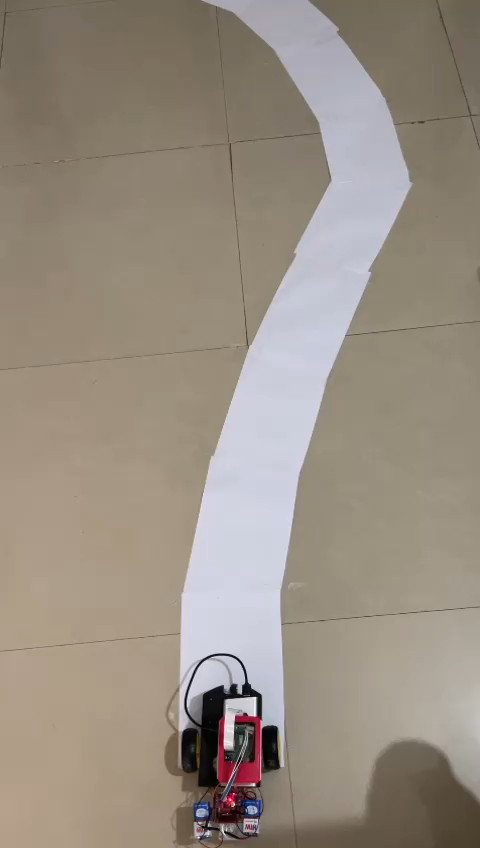

# PathPilot-A-Lane-Tracking-Bot
PathPilot is an intelligent lane tracking robot designed to navigate and carry objects within a predefined mapped area. Engineered computer vision technologies. It's a versatile solution for efficient and precise object transportation.

# Lane Tracking Robot

Welcome to the Lane Tracking Robot project! This project focuses on building a prototype of a lane-tracking robot using a Raspberry Pi. The robot is designed to autonomously navigate, detect obstacles, follow lanes, and recognize traffic signals.

## Project Overview

The main features of the Lane Tracking Robot include:

- **Obstacle Avoidance:** Utilizes ultrasonic sensors to detect obstacles in the robot's path. If an obstacle is detected within a certain range, the robot stops and adjusts its direction to avoid collisions.

- **Lane Tracking:** Implements lane tracking using a Pi camera and OpenCV. The robot identifies lanes in its environment, calculates the lane slope, and adjusts its movement to stay within the lanes. It can turn left, right, or move straight based on the lane detection.

- **Traffic Signal Detection:** Incorporates image processing to recognize and respond to traffic signals. The robot can interpret traffic signals and take appropriate actions, enhancing its ability to navigate in diverse environments.

- **Automatic Parking:** Integrates ultrasonic sensors for automatic parking. When the robot detects a suitable parking spot, it autonomously parks itself, showcasing intelligent parking capabilities.

## Hardware Requirements

- Raspberry Pi Model 3B
- Raspberry Pi 5v Camera
- HCSR04 Ultrasonic Sensors (x2)
- L293D Motor Driver
- Robot Chassis
- Power Bank
- 9v Battery
- Set of Jumper Wires
- 16 GB Micro SD Card
- Breadboard

## Software Requirements

- Raspian OS
- PuTTY SSH Session
- Remote Desktop Connection
- OpenCV 3.0
- Python 2.7

## Modules Overview

### I] Obstacle Avoidance

**Working Steps:**
1. The ultrasonic sensor's Trig pin is triggered externally.
2. A signal is transmitted from the sensor module.
3. The signal reflects after hitting a surface, and the receiver detects it.
4. The Echo pin stays high during signal transmission and reception.
5. The time delay is converted into distance using appropriate calculations.
6. The Pi processes this information. If the distance to the obstacle is less than 30cm, the robot stops.
7. The left wheels move opposite to the right wheels, allowing the robot to turn.

### II] Lane Tracking

**Working Steps:**
1. Extract the color range for the road.
2. Convert the image into grayscale.
3. Identify lanes in white/yellow color using the Canny edge algorithm.
4. Define the region of interest with an image mask.
5. Transform curved lines using the Hough transform.
6. Find the slope of lanes obtained from the Hough transform.
7. Adjust the robot's direction based on the lane slope. If the slope indicates a left or right turn, the robot responds accordingly.
8. Repeat the process continuously.

(_Add space for images_)

Feel free to explore and enhance this Lane Tracking Robot project for your specific use case or integrate additional functionalities. If you encounter any issues or have suggestions, please contribute and collaborate!

